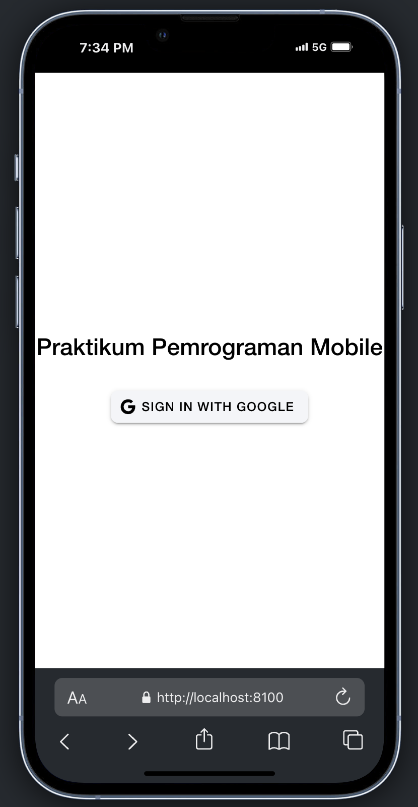
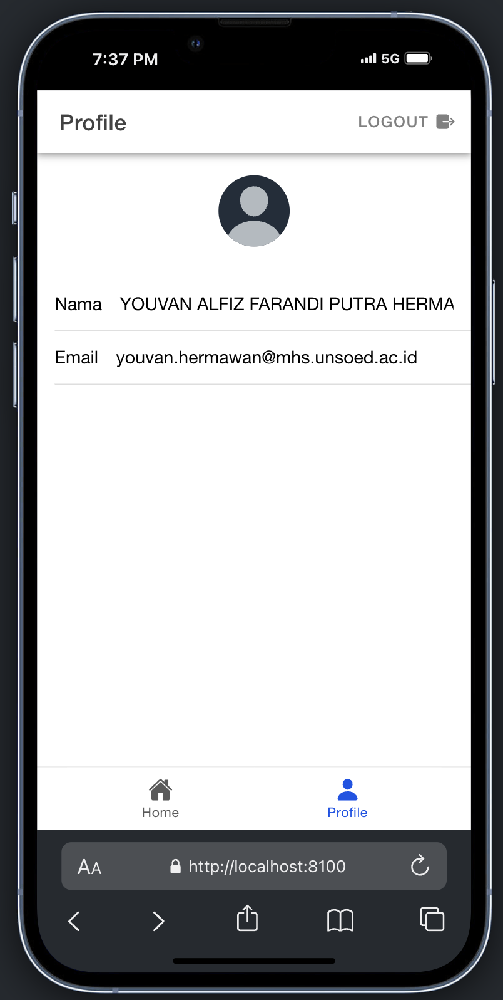
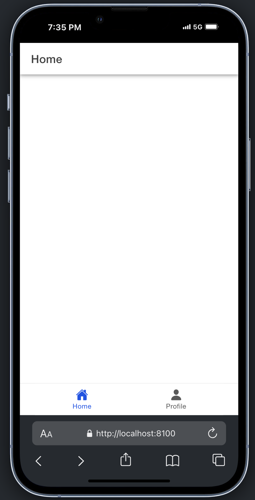

# Penjelasan Proses Autentikasi Google di Ionic 8 dengan Vue + Firebase

1. Menginisialisasi Firebase dan Konfigurasi Auth

Pada file src/utils/firebase.ts, aplikasi menginisialisasi Firebase menggunakan konfigurasi dari Firebase Console. Berikut adalah kode yang digunakan:

        import { initializeApp } from "firebase/app";
        import { getAuth, GoogleAuthProvider } from 'firebase/auth';

        const firebaseConfig = {
            apiKey: "",
            authDomain: "",
            projectId: "",
            storageBucket: "",
            messagingSenderId: "",
            appId: "",
        };

        const firebase = initializeApp(firebaseConfig);
        const auth = getAuth(firebase);
        const googleProvider = new GoogleAuthProvider();

        export { auth, googleProvider };

### initializeApp: 
Menginisialisasi Firebase dengan konfigurasi firebaseConfig.
### getAuth: 
Mengambil instance Firebase Authentication untuk digunakan dalam aplikasi.
### GoogleAuthProvider: 
Menyediakan metode autentikasi menggunakan Google.

2. Inisialisasi Google Auth di Capacitor

Pada file src/stores/auth.ts, aplikasi menginisialisasi GoogleAuth dari @codetrix-studio/capacitor-google-auth:

        await GoogleAuth.initialize({
            clientId: 'YOUR_CLIENT_ID',
            scopes: ['profile', 'email'],
            grantOfflineAccess: true,
        });

### clientId: 
Merupakan Client ID yang diambil dari Google API Console.
### scopes: 
Mengatur cakupan data yang diminta dari akun Google (misalnya profile dan email).
### grantOfflineAccess: 
Mengizinkan aplikasi untuk mendapatkan token saat offline.

3. Login dengan Google

Pada fungsi loginWithGoogle di auth.ts, proses autentikasi dimulai:

        const googleUser = await GoogleAuth.signIn();
        const idToken = googleUser.authentication.idToken;
        const credential = GoogleAuthProvider.credential(idToken);
        const result = await signInWithCredential(auth, credential);
        user.value = result.user;

### GoogleAuth.signIn(): 
Memulai proses login menggunakan akun Google. Pengguna akan diarahkan ke halaman login Google.
### idToken: 
Setelah login berhasil, aplikasi mendapatkan token autentikasi (ID Token) dari akun Google pengguna.
### GoogleAuthProvider.credential(idToken): 
Mengubah ID Token menjadi credential yang digunakan oleh Firebase Authentication.
### signInWithCredential(auth, credential): 
Menggunakan credential untuk login ke Firebase Authentication.
### user.value = result.user: 
Menyimpan informasi pengguna yang berhasil login.

4. Menyimpan dan Mengamati Status Autentikasi

Aplikasi menggunakan Firebase method onAuthStateChanged untuk mendeteksi perubahan status autentikasi pengguna:

        onAuthStateChanged(auth, (currentUser) => {
            user.value = currentUser;
        });

### onAuthStateChanged: 
Fungsi callback ini akan dipanggil setiap kali ada perubahan status autentikasi (misalnya saat login atau logout).
### user.value = currentUser:
Menyimpan data pengguna yang sedang login ke dalam state aplikasi (Pinia store).

5. Mendapatkan Data Profil Pengguna

Data pengguna seperti nama (displayName), email (email), dan foto profil (photoURL) diambil dari objek user:

        const userPhoto = ref(user.value?.photoURL || 'https://ionicframework.com/docs/img/demos/avatar.svg');

Pada halaman ProfilePage.vue, data pengguna ditampilkan menggunakan binding Vue:

        <ion-input label="Nama" :value="user?.displayName" :readonly="true"></ion-input>
        <ion-input label="Email" :value="user?.email" :readonly="true"></ion-input>

### user.value?.displayName:
Mengambil nama pengguna dari akun Google.
### user.value?.email: 
Mengambil email pengguna.
### user.value?.photoURL: 
Mengambil URL foto profil pengguna.

6. Logout dari Aplikasi

Fungsi logout di store auth.ts digunakan untuk keluar dari akun Google:

        await signOut(auth);
        await GoogleAuth.signOut();
        user.value = null;
        router.replace("/login");

### signOut(auth): 
Menghapus sesi autentikasi pengguna dari Firebase.
### GoogleAuth.signOut(): 
Menghapus sesi login dari akun Google di perangkat.
### user.value = null: 
Menghapus data pengguna dari state aplikasi.
### router.replace("/login"):
Mengarahkan pengguna kembali ke halaman login.

7. Pengaturan Navigasi dan Proteksi Rute

Pada file src/router/index.ts, terdapat guard untuk melindungi rute yang memerlukan autentikasi:

        router.beforeEach(async (to, from, next) => {
            const authStore = useAuthStore();

            if (authStore.user === null) {
                await new Promise<void>((resolve) => {
                    const unsubscribe = onAuthStateChanged(auth, () => {
                        resolve();
                        unsubscribe();
                    });
                });
            }

            if (to.path === '/login' && authStore.isAuth) {
                next('/home');
            } else if (to.meta.isAuth && !authStore.isAuth) {
                next('/login');
            } else {
                next();
            }
        });

### router.beforeEach: 
Mengecek apakah pengguna sudah login sebelum mengakses rute tertentu.
### to.meta.isAuth: 
Menandakan rute yang memerlukan autentikasi.
### authStore.isAuth: 
Mengembalikan nilai true jika pengguna sudah login, false jika belum.

