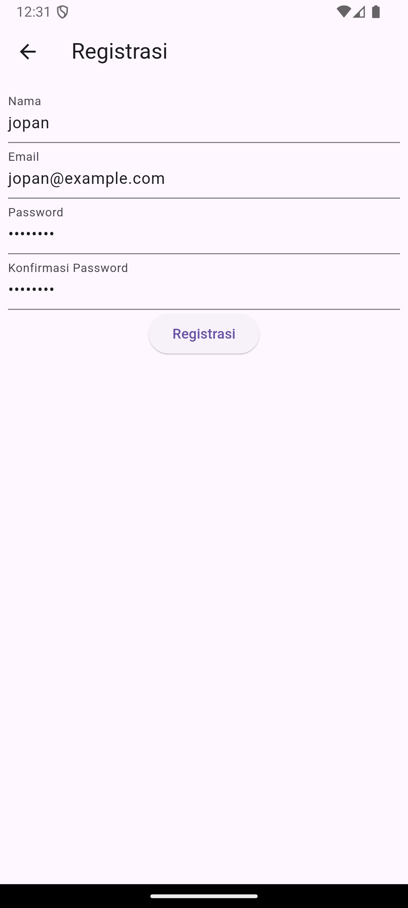
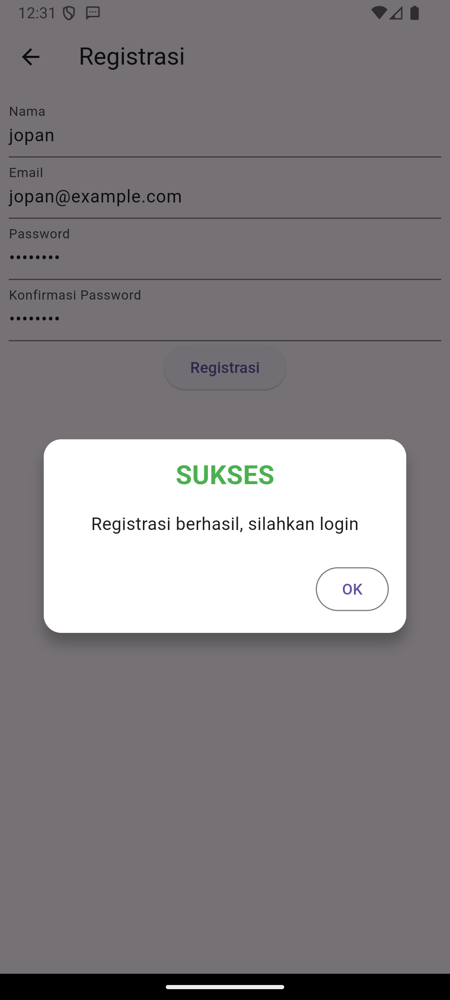
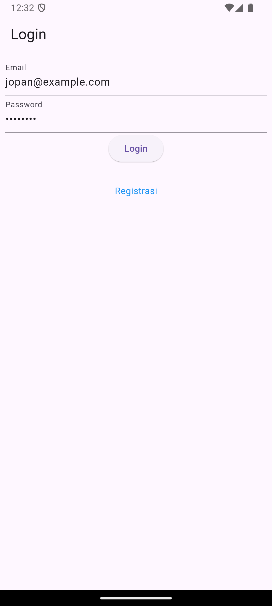
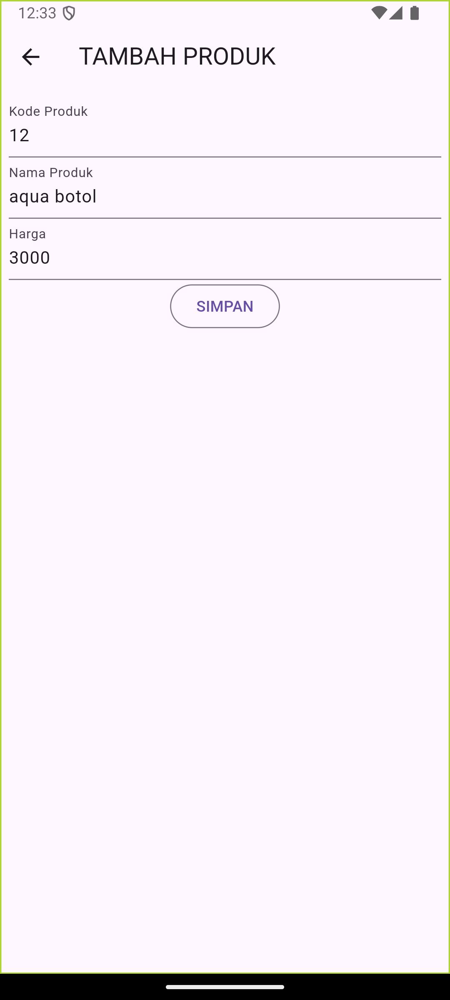
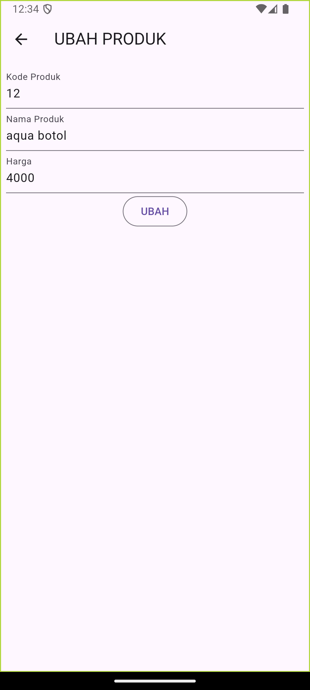

#   tokokita

##  Proses Registrasi
1. Backend - API (CodeIgniter)
    Model MRegistrasi:

    Model ini berfungsi untuk berinteraksi dengan tabel member di database.
    Hanya tiga kolom yang diizinkan untuk diisi: nama, email, dan password.
    Controller RegistrasiController:

    Di dalam method registrasi(), data diambil dari permintaan (request) yang dikirim dari aplikasi Flutter.
    Data yang diambil meliputi:
    nama
    email
    password (yang di-hash menggunakan password_hash untuk keamanan).
    Setelah data disiapkan, model MRegistrasi digunakan untuk menyimpan data tersebut ke dalam database.
    Setelah penyimpanan berhasil, respons dikembalikan dengan status 200 dan pesan "Registrasi Berhasil".
2. Frontend - Flutter
    Model Registrasi:

    Model ini merepresentasikan data respons dari API.
    Terdapat tiga properti: code, status, dan data, yang akan diisi berdasarkan respons JSON dari API.
    Halaman Registrasi RegistrasiPage:

    Halaman ini menyediakan form bagi pengguna untuk mengisi informasi registrasi.
    Terdapat empat field:
    Nama: Minimal 3 karakter.
    Email: Harus diisi dan mengikuti format email yang valid.
    Password: Minimal 6 karakter.
    Konfirmasi Password: Harus sama dengan field password.
    

    Proses Registrasi:

    Form Validasi:

    Saat pengguna menekan tombol "Registrasi", form divalidasi. Jika ada field yang tidak valid, pesan kesalahan ditampilkan.
    Validasi dilakukan menggunakan:

    validator: (value)

    if (value!.isEmpty) //digunakan untuk mengecek apakah field terisi

    if (!regex.hasMatch(value)) //unutk mengecek apakah email falid sesuai regex

    Mengirim Data:

    Jika semua field valid, method _submit() dipanggil.
    Form disimpan, dan loading indicator diaktifkan (_isLoading diatur ke true).
    Data dari form (nama, email, password) dikirim ke RegistrasiBloc untuk melakukan panggilan ke API.

    Menangani Respons:

    Jika registrasi berhasil (respons sukses), dialog sukses ditampilkan yang memberitahukan pengguna bahwa registrasi berhasil dan mereka dapat login.
    
    Jika terjadi kesalahan (misalnya, email sudah terdaftar), dialog peringatan ditampilkan.

    Mengatur Status Loading:

    Setelah pengiriman data, loading indicator dinonaktifkan kembali (_isLoading diatur ke false).

##  Proses Login

1. Backend - API (CodeIgniter)

    Model MLogin

    Model ini berfungsi untuk berinteraksi dengan tabel member_token di database.
    Kolom yang diizinkan untuk diisi: member_id dan auth_key.

    Controller LoginController

    Method login():
    Data email dan password diambil dari permintaan (request).
    Mencari member dengan email menggunakan model MMember.
    Jika email tidak ditemukan, respons dikembalikan dengan status 400 dan pesan "Email tidak ditemukan".
    Jika email ditemukan tetapi password tidak valid (diperiksa menggunakan password_verify), respons dikembalikan dengan status 400 dan pesan "Password tidak valid".
    Jika berhasil login:
    Membuat token otentikasi (auth_key) menggunakan method RandomString().
    Menyimpan member_id dan auth_key ke dalam tabel member_token.
    Mengembalikan respons yang berisi token dan informasi pengguna (ID dan email).

2. Frontend - Flutter

    Model Login

    Model ini merepresentasikan data respons dari API saat login.
    Memiliki properti: code, status, token, userID, dan userEmail.
    Method fromJson() digunakan untuk mengonversi respons JSON menjadi objek Login.

    Halaman Login LoginPage

    Halaman ini berfungsi untuk menerima input dari pengguna.
    Terdapat dua field input:
    Email: Validasi untuk memastikan tidak kosong.
    Password: Validasi untuk memastikan tidak kosong.
    

    Proses Login:

    Form Validasi:

    Saat pengguna menekan tombol "Login", form divalidasi. Jika ada field yang tidak valid, pesan kesalahan ditampilkan.

    Mengirim Data:

    Jika validasi sukses, method _submit() dipanggil.
    Form disimpan, dan loading indicator diaktifkan (_isLoading diatur ke true).
    Data dari form (email dan password) dikirim ke LoginBloc untuk melakukan panggilan ke API.

    Menangani Respons:

    Jika login berhasil (status code 200), token dan ID pengguna disimpan menggunakan UserInfo untuk sesi pengguna.
    
    Setelah berhasil, pengguna diarahkan ke halaman ProdukPage.
    Jika login gagal, dialog peringatan ditampilkan dengan pesan "Login gagal, silahkan coba lagi".

    Mengatur Status Loading:

    Setelah pengiriman data, loading indicator dinonaktifkan kembali (_isLoading diatur ke false).

    Bloc LoginBloc

    Method login():

    Mengambil URL API untuk login.
    Mengirim permintaan POST ke API dengan body yang berisi email dan password.
    Mengonversi respons JSON menjadi objek Login menggunakan method fromJson().

##  Produk Page

Proses Menampilkan Data pada Halaman Daftar Produk
1. Permintaan Data ke Backend

    Saat halaman ProdukPage dibuka, FutureBuilder digunakan untuk mengambil data produk secara asinkron.
    Di dalam FutureBuilder, metode ProdukBloc.getProduks() dipanggil untuk mengirim permintaan ke API yang telah ditentukan untuk mendapatkan daftar produk.

2. Mengambil Data dari API

    Di dalam ProdukBloc.getProduks(), API URL yang sesuai (misalnya, ApiUrl.listProduk) digunakan untuk melakukan permintaan GET.
    API backend (dalam ProdukController) akan menerima permintaan ini dan memanggil metode list().

3. Pengolahan di Backend

    Metode list() di ProdukController mengambil semua produk dari database menggunakan model MProduk.
    Data produk diambil melalui findAll() dan kemudian dikembalikan sebagai respons JSON ke frontend. Respons ini mencakup status dan data produk.

4. Parsing Respons JSON

    Setelah menerima respons dari API, data JSON yang diterima diparsing menjadi objek Dart.
    Dalam ProdukBloc, data JSON di-decode dan dipetakan ke dalam daftar objek Produk menggunakan Produk.fromJson().

5. Menampilkan Data di UI

    Di ProdukPage, FutureBuilder memantau status permintaan data. Jika data berhasil diambil (snapshot.hasData), maka widget ListProduk dibangun.
    ListProduk adalah widget yang bertanggung jawab untuk menampilkan daftar produk. Ia menggunakan ListView.builder() untuk membuat item produk secara dinamis berdasarkan jumlah produk yang ada dalam daftar.

6. Membuat Item Produk

    Untuk setiap item dalam daftar produk, widget ItemProduk dibuat. Ini menampilkan nama produk dan harga.
    Setiap ItemProduk adalah GestureDetector, sehingga saat pengguna mengetuk item tersebut, navigasi ke halaman detail produk (ProdukDetail) terjadi.

    

## Tambah dan Edit Produk

Proses Tambah Produk

1. Membuka Halaman Form

    Ketika pengguna mengklik tombol "Tambah Produk", aplikasi akan menavigasi ke halaman ProdukForm.
    Di sini, judul form ditampilkan sebagai "TAMBAH PRODUK" dan tombol diset untuk "SIMPAN".

2. Mengisi Form

    Pengguna akan mengisi informasi produk di dalam form, seperti Kode Produk, Nama Produk, dan Harga.
    Masing-masing field memiliki validator untuk memastikan bahwa data yang diinputkan tidak kosong.
    

3. Menangani Pengiriman Data

    Ketika pengguna mengklik tombol "SIMPAN":
    Validasi form dilakukan. Jika validasi berhasil, maka fungsi simpan() dipanggil.
    Di dalam simpan(), status loading diatur agar tidak ada interaksi lebih lanjut hingga proses selesai.

4. Membuat Objek Produk

    Sebuah objek Produk baru dibuat dengan data yang diisi dalam form.
    Nilai-nilai dari TextEditingController diambil dan diassign ke properti objek produk.

5. Mengirim Data ke Backend

    Metode ProdukBloc.addProduk() dipanggil dengan objek produk sebagai argumen.
    Fungsi ini akan mengirim permintaan POST ke API untuk menyimpan produk baru di database.

6. Menangani Respons

    Setelah permintaan berhasil, pengguna akan dinavigasi kembali ke halaman ProdukPage.
    Jika terjadi kesalahan, dialog peringatan akan ditampilkan kepada pengguna.

Proses Ubah Produk

1. Membuka Halaman Form untuk Ubah Produk

    Jika pengguna memilih untuk mengubah produk yang ada, halaman ProdukForm juga akan dibuka.
    Di sini, judul form diubah menjadi "UBAH PRODUK", dan tombol diubah menjadi "UBAH".
    Data produk yang ingin diubah diisi ke dalam field form melalui TextEditingController.

2. Mengisi Form

    Pengguna dapat melakukan perubahan pada field Kode Produk, Nama Produk, dan Harga.
    

3. Menangani Pengiriman Data

    Ketika pengguna mengklik tombol "UBAH":
    Validasi form dilakukan. Jika validasi berhasil, maka fungsi ubah() dipanggil.
    Status loading diatur sama seperti pada proses tambah produk.

4. Membuat Objek Produk untuk Ubah

    Objek Produk baru dibuat menggunakan ID produk yang sudah ada dan mengupdate nilai-nilai yang diubah berdasarkan input dari form.

5. Mengirim Data ke Backend

    Metode ProdukBloc.updateProduk() dipanggil dengan objek produk yang telah diperbarui.
    Fungsi ini akan mengirim permintaan PUT ke API untuk memperbarui data produk di database.

6. Menangani Respons

    Setelah permintaan berhasil, pengguna akan kembali ke halaman ProdukPage.
    Jika terjadi kesalahan, dialog peringatan akan ditampilkan.

