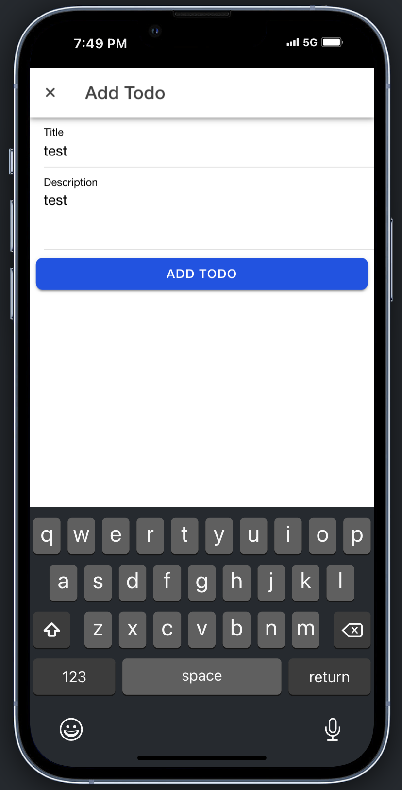
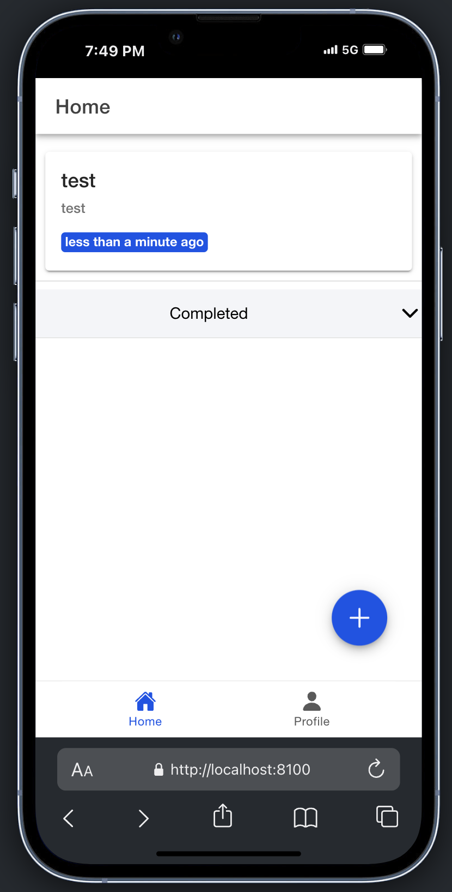
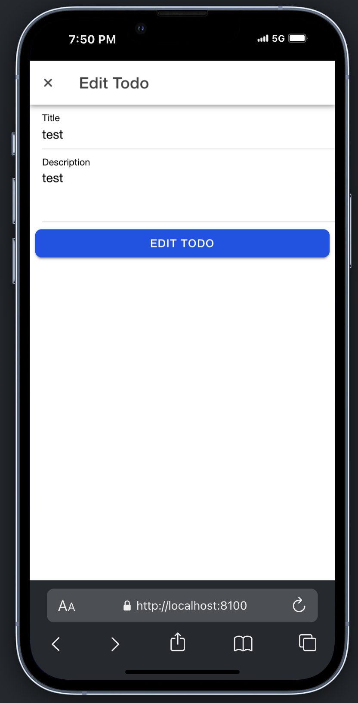
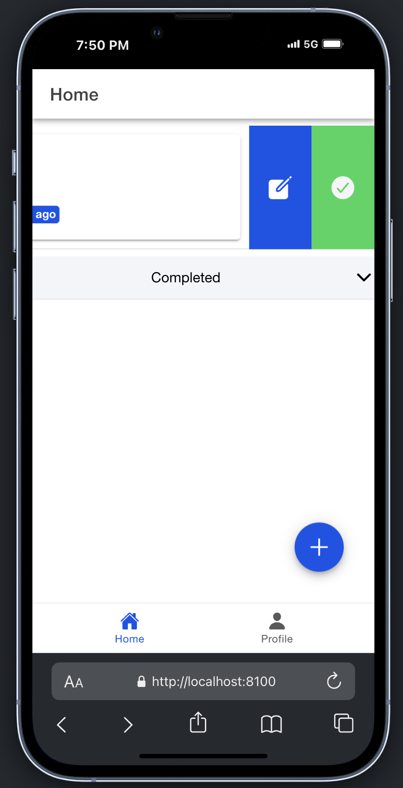
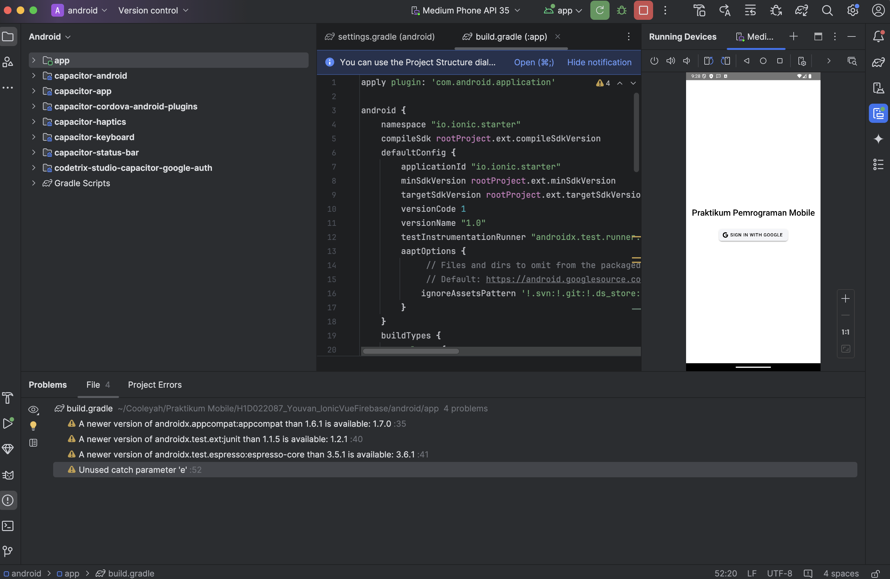

# Penjelasan Proses CRUD di Ionic 8 dengan Vue + Firebase

1. Create (Menambahkan Data)
Fungsi untuk menambahkan data baru ke dalam Firestore.

        async addTodo(todo: Omit<Todo, 'id'>) {
        const todoRef = this.getTodoRef();
        const docRef = await addDoc(todoRef, {
            ...todo,
            status: false,
            createdAt: Timestamp.now(),
            updatedAt: Timestamp.now()
        });
        return docRef.id;
        }

Penjelasan:

1. Fungsi addTodo menerima data todo tanpa ID.
2. Data yang dimasukkan diberi properti tambahan seperti status, createdAt, dan updatedAt.
3. Data disimpan dalam Firestore pada koleksi todos milik pengguna.
4. ID dokumen yang dibuat dikembalikan untuk referensi.

Implementasi UI:

1. Data ditambahkan melalui modal input di halaman HomePage.vue.
2. Tombol Add membuka modal untuk memasukkan data baru.

2. Read (Membaca Data)
Fungsi untuk mengambil data dari Firestore.

        async getTodos(): Promise<Todo[]> {
            const todoRef = this.getTodoRef();
            const q = query(todoRef, orderBy('updatedAt', 'desc'));
            const snapshot = await getDocs(q);
            return snapshot.docs.map((doc) => ({
                id: doc.id,
                ...doc.data()
            } as Todo));
        }

Penjelasan:

1. Fungsi getTodos mengambil semua data dari koleksi todos pengguna saat ini.
2. Data diurutkan berdasarkan updatedAt secara menurun (dokumen terbaru muncul di atas).
3. Setiap dokumen diubah menjadi format objek Todo dengan ID yang diambil dari doc.id.

Implementasi UI:

1. Data ditampilkan dalam dua kategori:
Active Todos: Belum selesai.
Completed Todos: Sudah selesai.
2. Pengguna dapat melakukan refresh data dengan menarik layar ke bawah.

3. Update (Memperbarui Data)
Fungsi untuk memperbarui data yang ada di Firestore.

        async updateTodo(id: string, todo: Partial<Todo>) {
            const todoRef = this.getTodoRef();
            const docRef = doc(todoRef, id);
            await updateDoc(docRef, {
                ...todo,
                updatedAt: Timestamp.now()
            });
        }

Penjelasan:

1. Fungsi updateTodo memperbarui dokumen berdasarkan ID tertentu.
2. Data yang diperbarui di-merge dengan data yang ada.
3. Properti updatedAt diubah ke waktu saat ini untuk menunjukkan perubahan.

Implementasi UI:

1. Tombol Edit pada setiap Todo membuka modal dengan data yang bisa diedit.
2. Perubahan disimpan saat pengguna menekan tombol Edit pada modal.

4. Delete (Menghapus Data)
Fungsi untuk menghapus data dari Firestore. 

        async deleteTodo(id: string) {
            const todoRef = this.getTodoRef();
            const docRef = doc(todoRef, id);
            await deleteDoc(docRef);
        }

Penjelasan:

1. Fungsi deleteTodo menghapus dokumen berdasarkan ID tertentu.
2. Operasi ini permanen, sehingga data yang dihapus tidak bisa dikembalikan.

Implementasi UI:

1. Tombol Delete di UI menggunakan ikon Trash.
2. Pengguna juga bisa menghapus dengan menggeser item Todo ke kanan atau kiri.

5. Update Status (Mengubah Status)
Fungsi tambahan untuk menandai Todo sebagai selesai atau aktif kembali.

        async updateStatus(id: string, status: boolean) {
            const todoRef = this.getTodoRef();
            const docRef = doc(todoRef, id);
            await updateDoc(docRef, { status: status, updatedAt: Timestamp.now() });
        }

Penjelasan:

1. Fungsi updateStatus digunakan untuk mengubah status Todo menjadi selesai (true) atau belum selesai (false).
2. Properti updatedAt juga diperbarui.
Implementasi UI:

1. Tombol dengan ikon Checkmark Circle digunakan untuk menandai Todo sebagai selesai.
2. Tombol dengan ikon Close digunakan untuk mengembalikan Todo ke status aktif.

# Penjelasan Proses Build Aplikasi

1. Tambahkan Platform Android
Tambahkan platform Android ke proyek:

        ionic capacitor add android

2. Buka Proyek di Android Studio
Buka proyek di Android Studio dengan perintah berikut:

        ionic capacitor open android

3. Sikronasi

        ionic capacitor sync android

4. Build APK/Bundle
Untuk menghasilkan file APK atau Bundle:

        ionic capacitor build android

