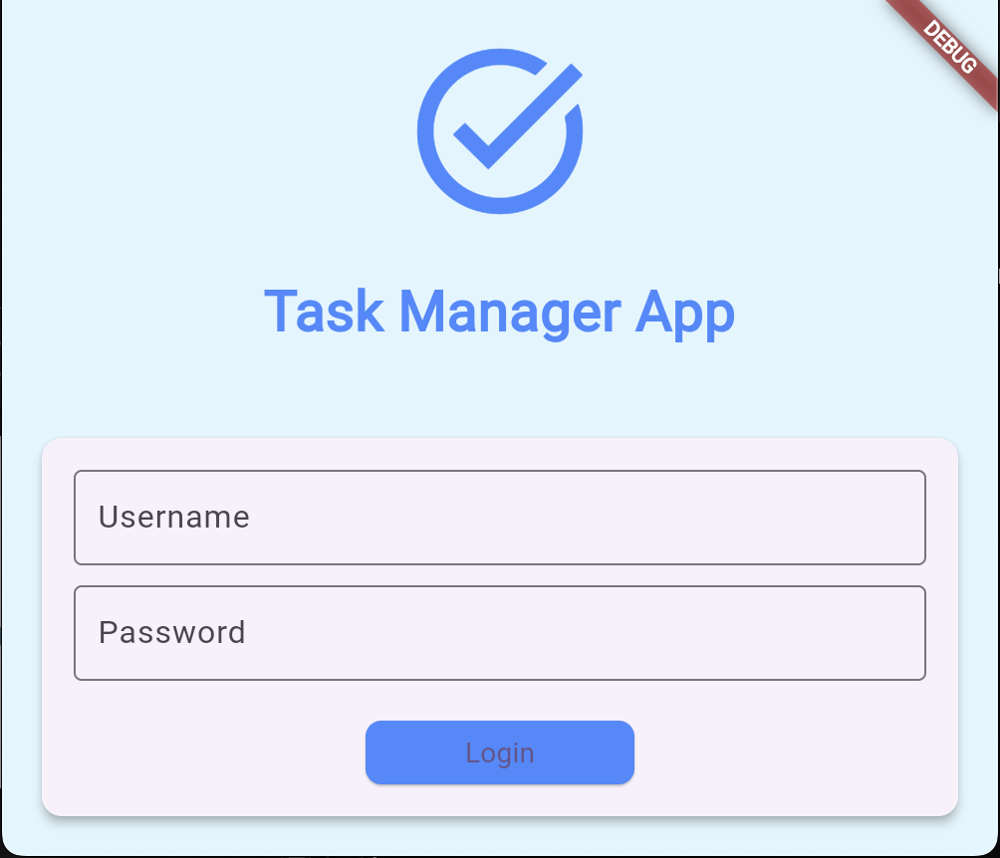
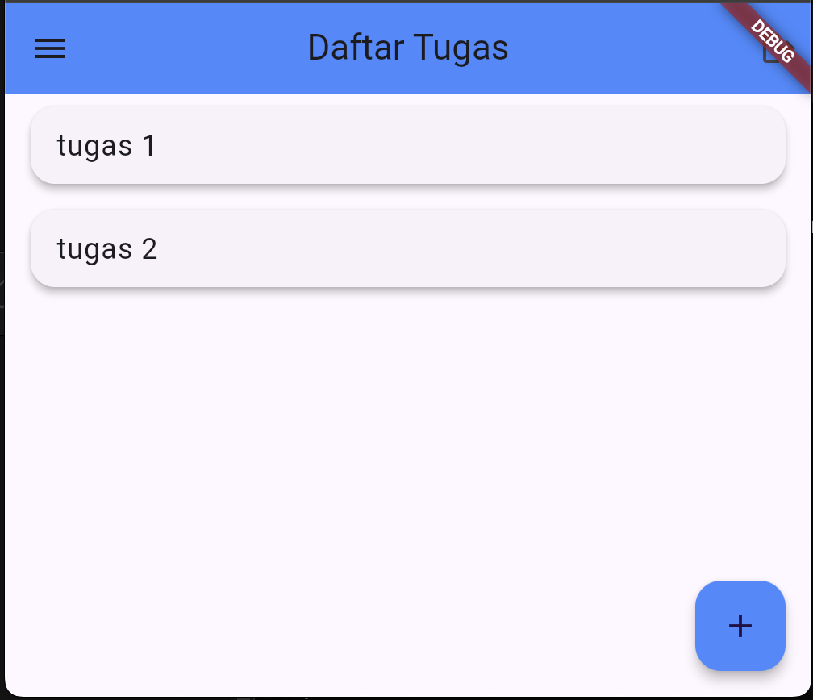
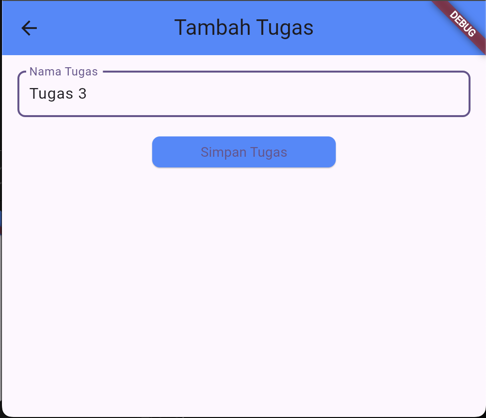
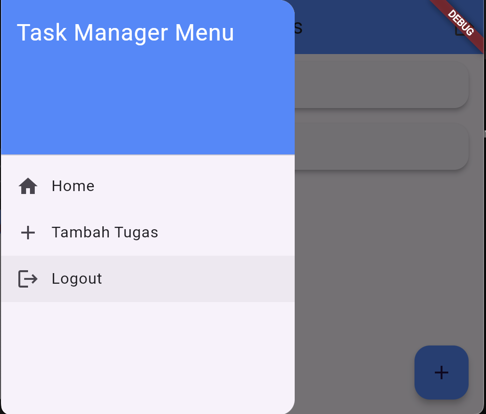

# Task Manager App

Aplikasi manajemen tugas sederhana yang dibangun menggunakan Flutter. Aplikasi ini memungkinkan pengguna untuk menambahkan, melihat, dan mengelola tugas dengan fitur login dan penyimpanan lokal menggunakan SharedPreferences.

Ussername   : test
Password    : test

## Fitur Utama
- Login dengan username dan password
- Tambah tugas baru
- Tampilkan daftar tugas
- Logout
- Side menu untuk navigasi

## Struktur Proyek
- **lib/**
  - **main.dart**: Titik masuk aplikasi.
  - **screens/**
    - **login_screen.dart**: Halaman untuk login.
    - **home_screen.dart**: Halaman utama yang menampilkan daftar tugas.
    - **add_task_screen.dart**: Halaman untuk menambahkan tugas baru.

## Penjelasan Kode

### 1. main.dart
Titik masuk aplikasi, di sini kita mendefinisikan routing untuk navigasi antara halaman.

initialRoute: '/',
      routes: {
        '/': (context) => LoginScreen(),
        '/home': (context) => HomeScreen(),
        '/addTask': (context) => AddTaskScreen(),
      },

Kode tersebut mengatur routing dalam aplikasi Flutter:

initialRoute: '/': Menentukan halaman awal yang ditampilkan, yaitu LoginScreen.
routes: { ... }: Mendefinisikan rute-rute yang ada:
'/': Menampilkan halaman login.
'/home': Menampilkan halaman utama dengan daftar tugas.
'/addTask': Menampilkan halaman untuk menambahkan tugas baru.

Ini memungkinkan navigasi antar halaman dengan mudah.

### 2. home_screen.dart

  Future<void> _loadTasks() async {
    SharedPreferences prefs = await SharedPreferences.getInstance();
    setState(() {
      tasks = prefs.getStringList('tasks') ?? [];
    });
  }

  Future<void> _logout() async {
    SharedPreferences prefs = await SharedPreferences.getInstance();
    await prefs.clear();
    Navigator.pushReplacementNamed(context, '/');
  }

Berikut penjelasan singkat untuk kedua fungsi tersebut:

_loadTasks()
Fungsi: Memuat daftar tugas dari SharedPreferences.
Langkah:
Mengambil instance SharedPreferences.
Mengupdate state dengan daftar tugas yang diambil dari SharedPreferences. Jika tidak ada, menginisialisasi dengan daftar kosong.

_logout()
Fungsi: Menghapus data login dan kembali ke halaman login.
Langkah:
Mengambil instance SharedPreferences.
Menghapus semua data yang tersimpan (logout).
Mengarahkan pengguna kembali ke halaman login dengan Navigator.pushReplacementNamed(context, '/').

drawer: Drawer(),

drawer: Drawer() adalah bagian dari widget Scaffold yang digunakan untuk menampilkan side menu (navigasi samping) dalam aplikasi Flutter. Berikut penjelasannya:

Drawer: Merupakan widget yang dapat ditarik dari sisi layar, berfungsi sebagai menu navigasi untuk aplikasi.
Fungsi: Memungkinkan pengguna untuk mengakses berbagai bagian aplikasi (seperti halaman home, tambah tugas, logout) dengan mudah.
Penggunaan: Biasanya berisi daftar item navigasi (menggunakan ListTile) yang mengarahkan pengguna ke halaman yang berbeda saat dipilih.

### 3. add_task_screen.dart

Berikut adalah penjelasan singkat mengenai bagian penting dari kode AddTaskScreen:

TextEditingController _taskController
Fungsi: Mengontrol input teks untuk nama tugas yang dimasukkan pengguna.

Future<void> _saveTask()
Fungsi: Menyimpan tugas baru ke dalam SharedPreferences.
Langkah:
Memeriksa apakah input tidak kosong.
Mengambil instance SharedPreferences.
Mengambil daftar tugas yang ada dan menambah tugas baru.
Menyimpan kembali daftar tugas ke SharedPreferences.
Menggunakan Navigator.pop(context, true) untuk kembali ke halaman sebelumnya dan mengindikasikan bahwa penyimpanan sukses.

@override Widget build(BuildContext context)
Fungsi: Membangun UI untuk halaman ini.
Komponen:
AppBar: Menampilkan judul "Tambah Tugas".
TextField: Tempat pengguna memasukkan nama tugas.
ElevatedButton: Tombol untuk menyimpan tugas, yang memanggil _saveTask saat ditekan.

### 4. login_screen.dart

Berikut adalah penjelasan singkat mengenai bagian penting dari kode LoginScreen:

TextEditingController _usernameController dan _passwordController
Fungsi: Mengontrol input teks untuk username dan password yang dimasukkan oleh pengguna.

Future<void> _login()
Fungsi: Memverifikasi kredensial pengguna dengan yang tersimpan di SharedPreferences.
Langkah:
Mengambil instance SharedPreferences.
Mengambil username dan password yang tersimpan (dengan default 'test').
Memeriksa apakah input username dan password sesuai dengan yang tersimpan.
Jika cocok, menyimpan status login dan mengarahkan pengguna ke halaman utama (/home).
Jika tidak cocok, menampilkan pesan kesalahan dengan mengupdate state.

@override Widget build(BuildContext context)
Fungsi: Membangun UI untuk halaman login.
Komponen:
AppBar: Menampilkan judul aplikasi.
TextField: Tempat pengguna memasukkan username dan password.
ElevatedButton: Tombol untuk melakukan login yang memanggil fungsi _login.
Pesan Kesalahan: Menampilkan pesan jika username atau password salah.

## Screenshot

