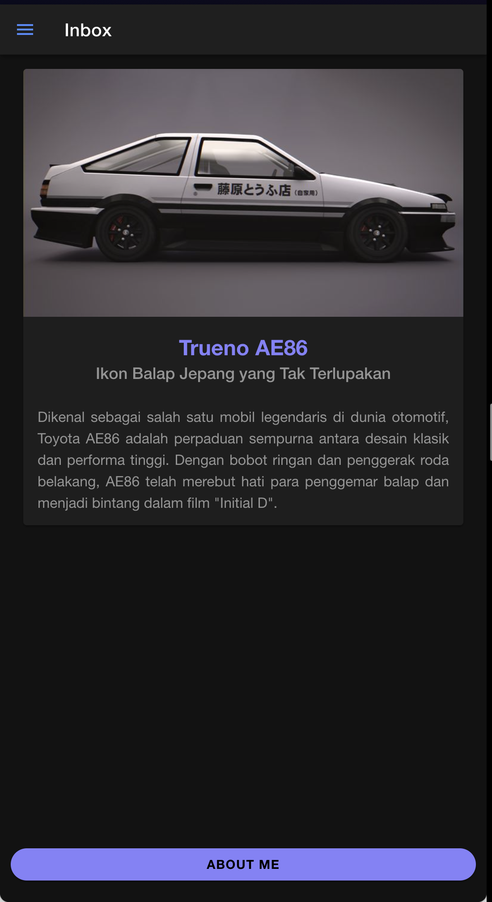
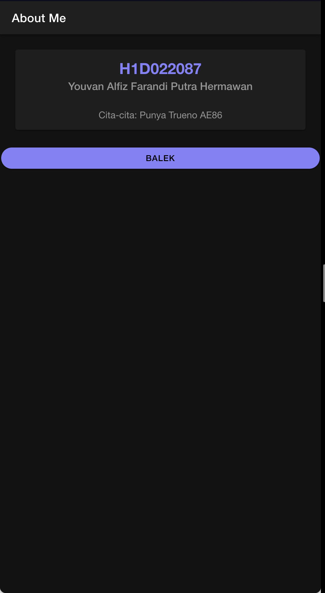

# Screenshot Halaman

1. Halaman 1

2. Halaman 2 

# Cara Menambahkan Komponen

## Komponen Pada Halaman Pertama

pada file folder.page.html,
tambahkan komponen pada bagian konten. pada kasus ini saya menggunakan card dan button.

    <ion-card>
      
      <ion-card-header>
        <ion-card-title class="card-title" color="tertiary">Trueno AE86</ion-card-title>
        <ion-card-subtitle class="card-subtitle">Ikon Balap Jepang yang Tak Terlupakan</ion-card-subtitle>
      </ion-card-header>
    
      <ion-card-content class="card-content">
        Dikenal sebagai salah satu mobil legendaris di dunia otomotif, 
        Toyota AE86 adalah perpaduan sempurna antara desain klasik dan performa tinggi. 
        Dengan bobot ringan dan penggerak roda belakang, AE86 telah merebut hati para penggemar balap 
        dan menjadi bintang dalam film "Initial D".  
      </ion-card-content>
    </ion-card>

Pada komponen card di atas sudah dilakukan styling baik menggunakan file .scss maupun menambahkan inline atribut seperti color.

    <ion-button id="infoButton" expand="full" shape="round" color="tertiary" routerLink="/info">About Me</ion-button>

Pada komponen button di atas juga sudah dilakukan styliing baik mengguanakn file .scss maupun menambahkan inline atribut seperti color, shape, dll. juga button ini berfungsi untuk mengarahkan halaman ke halaman yang di tuju menggunakan routerLink.

## Komponen Pada Halaman Kedua

Sebelum membuat komponen di halaman kedua, tentu saja halaman kedua perlu dibuat terlebih dahulu. Menggunakan promt "ionic generate page namaPage"

Sama seperti pada halaman sebelumnya, pada halaman ini terdapat card dan juga button, namun card yang ada pada halaman ini tidak menampilkan gambar.

    <ion-card>
      <ion-card-header>
        <ion-card-title class="card-title" color="tertiary">H1D022087</ion-card-title>
        <ion-card-subtitle class="card-subtitle">Youvan Alfiz Farandi Putra Hermawan</ion-card-subtitle>
      </ion-card-header>
    
      <ion-card-content class="card-content">
        Cita-cita: Punya Trueno AE86
      </ion-card-content>
    </ion-card>

Untuk button hanya berbeda pada posisi nya dimana halaman sebelumnya memiliki posisi yang fix yaitu berada di bawah, sedangkan button pada halaman ini posisinya bergantung pada height komponen diatasnya. seperti pada halaman sebelumnya button juga berfungsi untuk menavigasi pengguna ke halaman utama menggunakan routerLink

    <ion-button id="infoButton" expand="full" shape="round" color="tertiary" routerLink="/">Balek</ion-button>