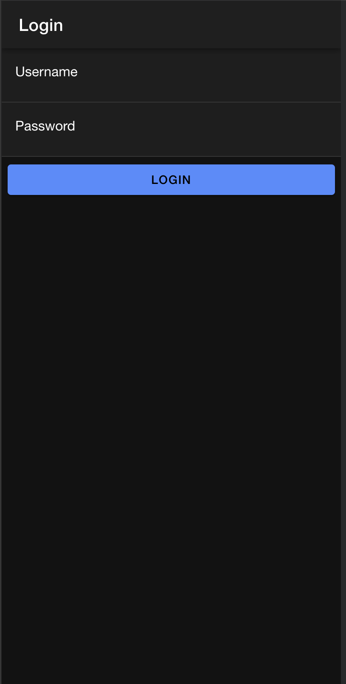

# Tampilan Login

## Halaman Login

## Ketika Login Berhasil

## Ketika Login Gagal

# Cara Kerja Login

## Database dan API
#### Database: Sebuah tabel user dibuat di database coba-ionic untuk menyimpan informasi pengguna, termasuk username dan password.
#### PHP API: File login.php di server berfungsi untuk memproses permintaan login. API ini menerima data dalam format JSON (username dan password), kemudian memverifikasi kredensial pengguna terhadap yang ada di database.
## Proses Login di Aplikasi Ionic
#### Halaman Login: Pada halaman login.page.html, pengguna diminta untuk memasukkan username dan password. Ini dikontrol oleh login.page.ts.

#### Mengirim Permintaan Login: Ketika pengguna mengklik tombol login, metode login() di login.page.ts dipanggil.Metode ini memeriksa apakah username dan password telah diisi. Jika ya, data tersebut dikemas dalam objek dan dikirim ke API menggunakan metode postMethod() dari AuthenticationService.
## Verifikasi di Server
#### API Login: Di server, file login.php menerima data JSON dari aplikasi.
#### Kredensial yang Dikirim: Username dan password yang dimasukkan pengguna akan diproses. Password akan di-hash menggunakan MD5 untuk membandingkannya dengan yang ada di database.
#### Respons dari API: Jika kredensial cocok, API mengembalikan respons JSON yang mencakup status login dan token. Jika tidak, respons menunjukkan bahwa login gagal.
## Menangani Respons di Aplikasi
#### Status Login: Jika status login adalah "berhasil", aplikasi menyimpan token dan username menggunakan Preferences dari @capacitor/preferences. Aplikasi kemudian mengarahkan pengguna ke halaman home (/home).
#### Menampilkan Notifikasi: Jika login gagal, pengguna mendapatkan notifikasi melalui notifikasi() yang memberitahukan mereka tentang kesalahan yang terjadi (username atau password salah).
## Guard dan Routing
#### Auth Guard: Di routing, ada authGuard yang memastikan hanya pengguna yang sudah terautentikasi yang bisa mengakses halaman home.
#### Auto Login Guard: autoLoginGuard memeriksa status autentikasi saat aplikasi dibuka. Jika pengguna sudah terautentikasi, mereka langsung diarahkan ke halaman home.
## Logout
#### Pengguna dapat melakukan logout dengan mengklik item di halaman home, yang akan memanggil metode logout() di AuthenticationService. Ini akan menghapus data pengguna yang tersimpan dan mengarahkan kembali ke halaman login.