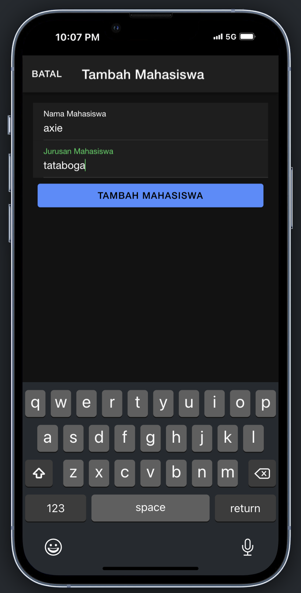
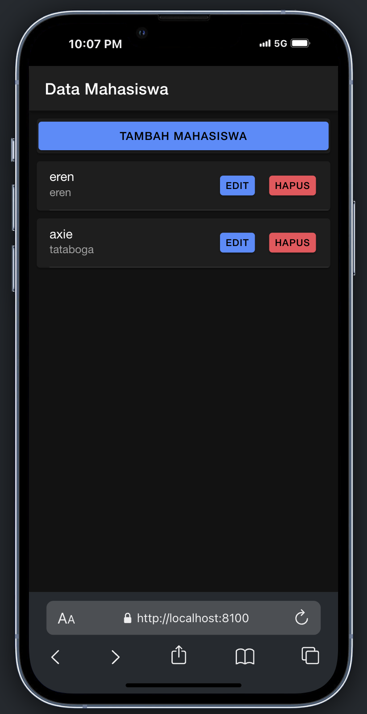
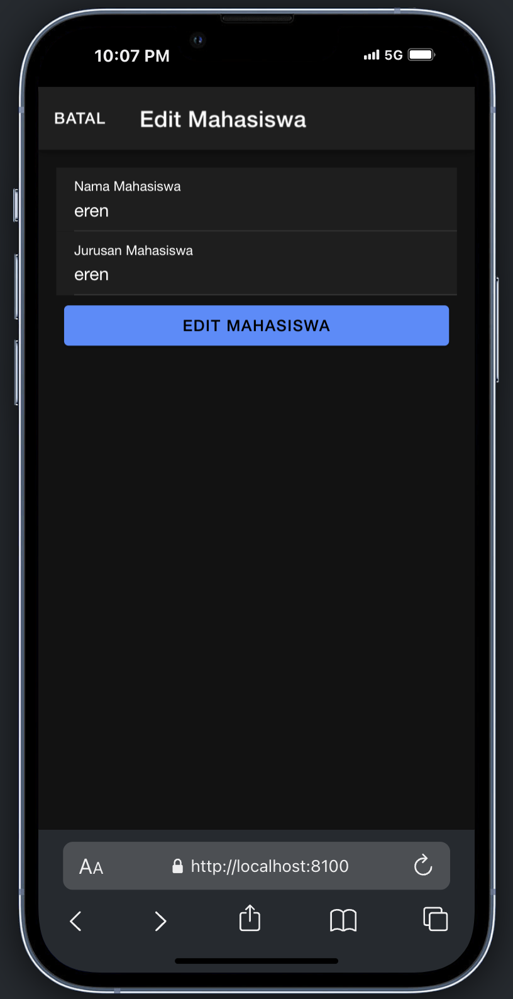
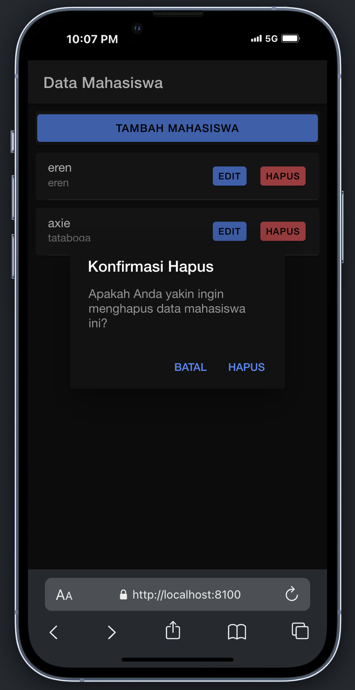

## CREATE (Tambah Data Mahasiswa)

Proses penambahan data mahasiswa menggunakan form input dan API tambah.php.

Alur Proses:

1. Pada halaman frontend, ketika pengguna mengisi form di modal tambah dan menekan tombol Tambah Mahasiswa, fungsi tambahMahasiswa() akan dipanggil.
2. Fungsi ini akan mengambil data input (nama dan jurusan) dan mengirimkannya ke API melalui method POST ke endpoint tambah.php.
3. Pada sisi backend (PHP), data dikirim melalui request body dan diterima menggunakan file_get_contents('php://input'). Data kemudian di-parse menggunakan json_decode().
4. Setelah data diterima, PHP akan melakukan query INSERT ke database untuk menambahkan data mahasiswa.
5. Jika proses berhasil, API akan mengembalikan status sukses ke aplikasi.

        // frontend (mahasiswa.page.ts)
        tambahMahasiswa() {
        if (this.nama !== '' && this.jurusan !== '') {
            const data = { nama: this.nama, jurusan: this.jurusan };
            this.api.tambah(data, 'tambah.php').subscribe({
            next: () => {
                this.resetModal();
                this.getMahasiswa();
                this.modalTambah = false;
            },
            error: (err: any) => {
                console.error('Gagal tambah mahasiswa', err);
            },
            });
        }
        }

        // backend (tambah.php)
        <?php
        require 'koneksi.php';
        $input = file_get_contents('php://input');
        $data = json_decode($input, true);
        $nama = trim($data['nama']);
        $jurusan = trim($data['jurusan']);

        if ($nama != '' && $jurusan != '') {
            $query = mysqli_query($koneksi, "INSERT INTO mahasiswa(nama, jurusan) VALUES('$nama', '$jurusan')");
            $pesan = true;
        } else {
            $pesan = false;
        }
        echo json_encode($pesan);

## READ (Tampilkan Data Mahasiswa)

Proses ini digunakan untuk mengambil dan menampilkan data mahasiswa yang tersimpan di database.

Alur Proses:

1. Pada halaman frontend, fungsi getMahasiswa() dipanggil saat halaman pertama kali di-load.
2. Fungsi ini akan melakukan GET request ke API tampil.php.
3. API akan mengambil seluruh data dari tabel mahasiswa di database dan mengirimkannya dalam format JSON ke aplikasi.
4. Data JSON ini kemudian di-parse dan ditampilkan menggunakan *ngFor pada frontend.

        // frontend (mahasiswa.page.ts)
        getMahasiswa() {
        this.api.tampil('tampil.php').subscribe({
            next: (res: any) => {
            this.dataMahasiswa = res;
            },
            error: (err: any) => {
            console.error(err);
            },
        });
        }

        // backend (tampil.php)
        <?php
        require 'koneksi.php';
        $data = [];
        $query = mysqli_query($koneksi, "SELECT * FROM mahasiswa");

        while ($row = mysqli_fetch_object($query)) {
            $data[] = $row;
        }
        echo json_encode($data);

## UPDATE (Edit Data Mahasiswa)

Proses ini digunakan untuk mengubah data mahasiswa yang sudah ada.

Alur Proses:

1. Pada halaman frontend, ketika pengguna mengklik tombol Edit, modal edit akan terbuka dan fungsi openModalEdit() dipanggil.
2. Fungsi ini akan mengambil data mahasiswa berdasarkan ID dan menampilkan data di form edit.
3. Setelah pengguna mengubah data dan menekan tombol Edit Mahasiswa, fungsi editMahasiswa() akan dipanggil.
4. Fungsi ini akan mengirim data yang diperbarui ke API edit.php menggunakan method PUT.
5. API akan melakukan query UPDATE pada database untuk mengubah data sesuai dengan ID yang diberikan.

        // frontend (mahasiswa.page.ts)
        editMahasiswa() {
        const data = { id: this.id, nama: this.nama, jurusan: this.jurusan };
        this.api.edit(data, 'edit.php').subscribe({
            next: () => {
            this.resetModal();
            this.getMahasiswa();
            this.modalEdit = false;
            },
            error: (err: any) => {
            console.error('Gagal edit mahasiswa', err);
            },
        });
        }

        // backend (edit.php)
        <?php
        require 'koneksi.php';
        $input = file_get_contents('php://input');
        $data = json_decode($input, true);
        $id = trim($data['id']);
        $nama = trim($data['nama']);
        $jurusan = trim($data['jurusan']);

        if ($nama != '' && $jurusan != '') {
            $query = mysqli_query($koneksi, "UPDATE mahasiswa SET nama='$nama', jurusan='$jurusan' WHERE id='$id'");
            $pesan = true;
        } else {
            $pesan = false;
        }
        echo json_encode($pesan);

## DELETE (Hapus Data Mahasiswa)

Proses penghapusan data mahasiswa dari database.

Alur Proses:

1. Ketika pengguna menekan tombol Hapus, fungsi konfirmasiHapus() akan dipanggil.
2. Fungsi ini menampilkan dialog konfirmasi menggunakan AlertController.
3. Jika pengguna memilih Hapus, fungsi akan mengirim DELETE request ke API hapus.php dengan ID mahasiswa yang akan dihapus.
4. API akan menjalankan query DELETE pada database dan mengembalikan status sukses jika data berhasil dihapus.

        // frontend (mahasiswa.page.ts)
        async konfirmasiHapus(id: any) {
        const alert = await this.alertController.create({
            header: 'Konfirmasi Hapus',
            message: 'Apakah Anda yakin ingin menghapus data mahasiswa ini?',
            buttons: [
            { text: 'Batal', role: 'cancel' },
            {
                text: 'Hapus',
                role: 'destructive',
                handler: () => {
                this.api.hapus(id, 'hapus.php?id=').subscribe({
                    next: () => {
                    this.getMahasiswa();
                    },
                    error: (err: any) => {
                    console.error('Gagal menghapus data', err);
                    },
                });
                },
            },
            ],
        });

        await alert.present();
        }

        // backend (hapus.php)
        <?php
        require 'koneksi.php';
        $id = $_GET['id'];
        $query = mysqli_query($koneksi, "DELETE FROM mahasiswa WHERE id='$id'");
        if ($query) {
            $pesan['status'] = 'sukses';
        } else {
            $pesan['status'] = 'gagal';
        }
        echo json_encode($pesan);

